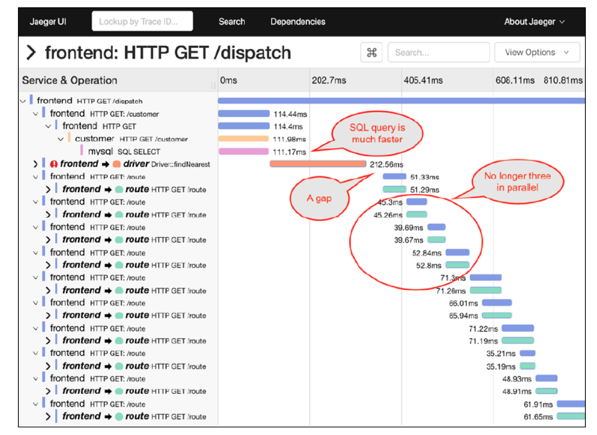

# Jaeger HOTROD sample 

이 예제는 Jaeger의 Sample Application인 HOTROD에 대한 설명이다.

## 사전준비사항
 - Docker : https://runnable.com/docker/install-docker-on-windows-10
 - Go lang

 ### Jeager 실행
 ```bash
 $ sudo docker run -d --name jaeger \
-p 6831:6831/udp \
-p 16686:16686 \
-p 14268:14268 \
jaegertracing/all-in-one:1.6
```
### HOTROD 실행

```bash
$ sudo docker run --rm -it \
--link jaeger \
-p8080-8083:8080-8083 \
jaegertracing/example-hotrod:1.6 \
all \
--jaeger-agent.host-port=jaeger:6831

```

### Jeager 접속
http://localhost:16686/

### HOTROD 접속 
http://localhost:8080/


### Source로 실행하기
```bash
mkdir -p $GOPATH/src/github.com/jaegertracing
cd $GOPATH/src/github.com/jaegertracing.git
clone git@github.com:jaegertracing/jaeger.git jaeger
cd jaeger
make install
cd examples/hotrod
go run ./main.go all
```

### 1. HOTROD 구조
HotROD는 일종의 Uber의 Car Sharing 서비스 같은 모습을 하고 있다. 
JavaScript로 구성된 UI에서 상점을 클릭하면 주변에 가까운 Driver중 가장 빨리 도착할 수 있는 Driver를 배정해 주는 서비스이다. 


상점을 여러번 클릭한상태에서 Jaeger UI에서 `Service`는 `frontend`를 선택하고 `Find Traces`를 클릭하면 호출한 만큼의 `Trace`를 확인할 수 있다. 


### 2. HOTROD 호출 구조
상단의 `Dependencies`를 클릭하고 `DAG(Directed Acyclic Graph)`를 클릭하면 Request Path에 따른 MicroService간의 Dependency를 파악할 수 있다. 


### 3. DataFlow 확인
`fronted: HTTP GET/dispatch`를 클릭하면 아래와 같이 해당 Trace의 DataFlow를 확인할 수 있다. 


### 4. Traditional Log vs Contextual Logs
좌측 상단의 `fronted: HTTP GET/dispatch`를 클릭해서 내부 정보중 `Logs (18)`을 보면 Trace의 전체 Span(개별 마이크로서비스들)에서 생성한 Log를 한곳에 모아서 보여줌으로써 End-2-End 분석을 할 수 있는 기능이 제공되며 이것은 각 System마다 분산되어 있는 전통적인 Log가 구별되는 Distributed Tracing의 강력한 기능이다. 


### 5. Tag와 Log를 이용한 Debugging
Jaeger는 `Span`의 `Tag`정보와 `Log`정보를 이용해 Trace중 발생한 오류상황의 정확히 파악하는데 도움을 준다. 
아래 그림에서 `Tags`의 `error=true`로 설정하면 `!` 마크를 통해 오류를 알려주며, Log에 적절한 값을 남김으로써 문제점을 파악하고 개선하는데 도움을 줄 수 있다. 


>#### 유용한 Recommended Tags
>**Tags : http.url**  
>**Tags : sql.query**


### 6. Critical Path (Latency)
전체 수행시간중 mysql의 실행시간이 가장 많이 소요되고 있음을 확인할 수 있다.


또한 Zoom in을 해서 보면 route service가 parallel이 아니라 3개씩 쌍으로 수행되는 것으로 나타난다. 


HOTROD 화면에서 같은 사용자로 버튼을 여러번 클릭해서 Request를 증가 시키면 mysql의 수행시간이 증가하면서 1초 이상으로 소요되는 것을 확인할 수 있다. (기존 300ms) 


문제를 추적하기 위해 HOTROD 화면애서 오래 걸린 Request의 Drive License를 복사해 아래 그림 처럼 Tags 정보로 Trace를 조회한다. 


Log 정보를 보면 내부적으로 blocking를 하면 Lock를 걸고 있는 것을 알고 있다. 
(이것을 Distributed Tracing을 이용한 Performance Analysis 기능의 Demo 목적으로 구현된 부분이다.)


내부적으로 소스코드를 보면 아래와 같이 Lock을 확인할 수 있다. 

examples/hotrod/services/customer/database.go


이것을 변경하려면 다음과 같이 실행하면 된다. 
```bash
$ docker run --rm -it \
--link jaeger \
-p8080-8083:8080-8083 \
jaegertracing/example-hotrod:1.6 \
-M -D 100ms all \
--jaeger-agent.host-port=jaeger:6831
```

```bash
#Go에서 직접 살행하는 경우
./example-hotrod -M -D 100ms all
```


다시 다량의 Request를
발생 시키면 여전히 delay를 확인할 수 있다.


sql의 실행 시간을 줄었으나 3개씩 순차적인 실행한다. 



소스 코드 "services/config/config.go"에서 

> RouteWorkerPoolSize = 3

때분이다.

아래와 같이 변경해서 경과를 확인하면 다음과 같다. 

```bash
$ docker run --rm -it \
--link jaeger \
-p8080-8083:8080-8083 \
jaegertracing/example-hotrod:1.6 \
-M -D 100ms -W 100 all \
--jaeger-agent.host-port=jaeger:6831
```


### Reference
[Take OpenTracing for a HotROD ride](https://medium.com/opentracing/take-opentracing-for-a-hotrod-ride-f6e3141f7941)

